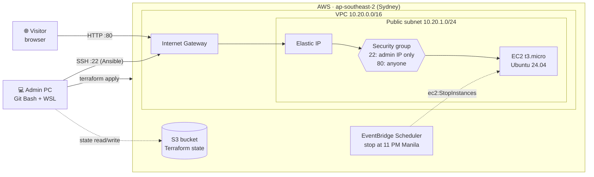
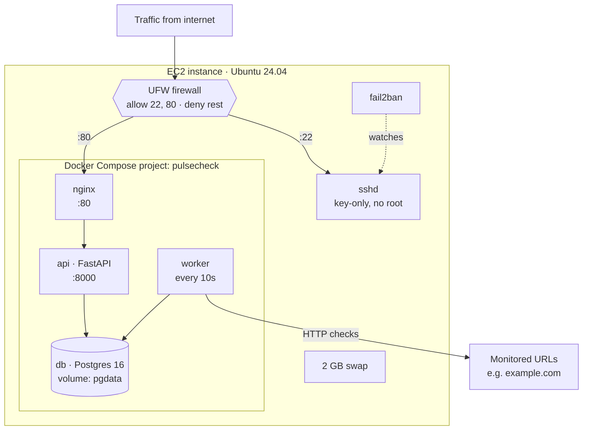
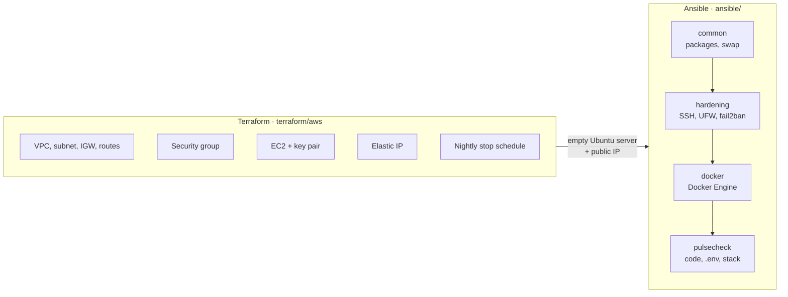
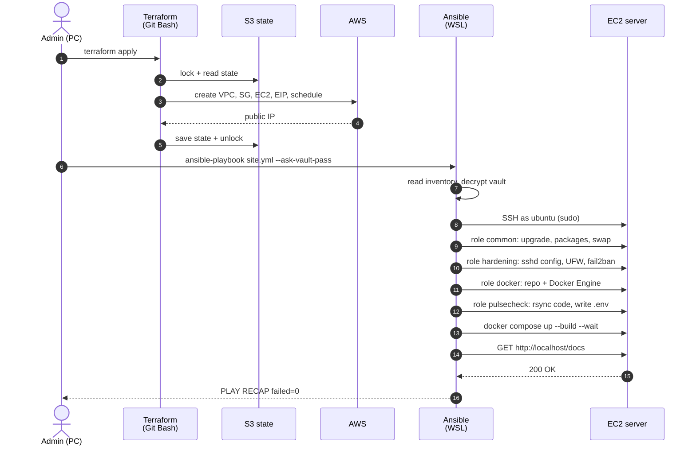
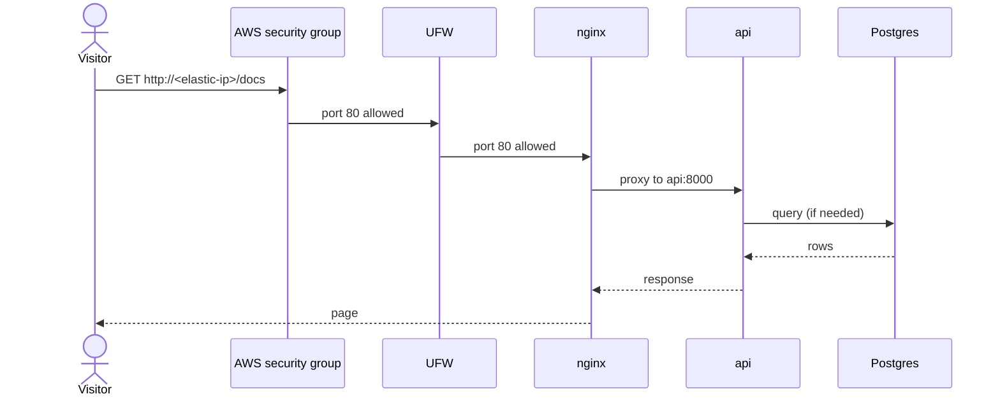
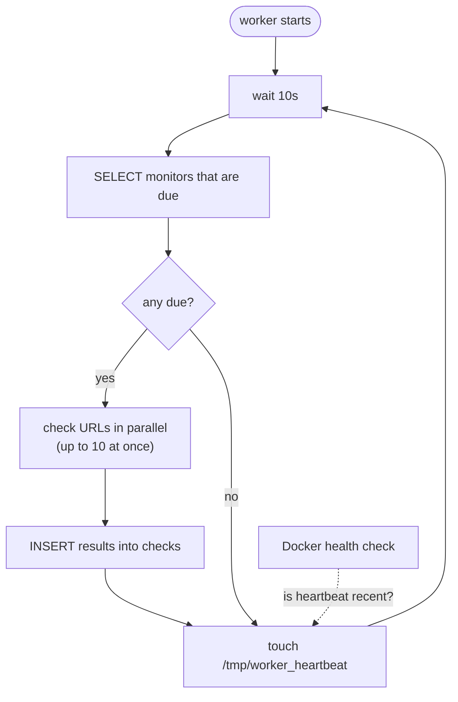
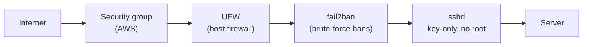
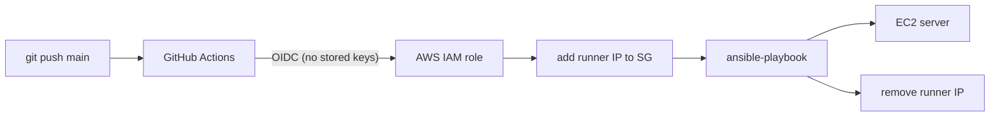

# pulsecheck: Architecture

Diagrams of how pulsecheck is built and deployed. See [README.md](README.md) for the full configuration details.

---

## 1. Infrastructure overview

Everything that exists on AWS, and who talks to what.

---

## 2. Inside the server

What runs on the EC2 instance once Ansible has finished.

---

## 3. Who owns what

Terraform builds the empty server. Ansible decides what runs on it.

---

## 4. Deployment flow

What happens, step by step, from nothing to a running app.

---

## 5. Request flow

A visitor opening the API docs page.

---

## 6. Worker loop

How monitoring actually happens, and how the health check knows the worker is alive.

---

## 7. Security layers

Each layer is independent, so one mistake doesn't expose the server.

| Layer              | Protects against                                                 |
| ------------------ | ---------------------------------------------------------------- |
| Security group     | Anyone except you reaching SSH at all                            |
| UFW                | Anything other than 22/80 if the security group is ever loosened |
| fail2ban           | Repeated failed logins                                           |
| sshd hardening     | Password guessing and direct root access                         |
| Ansible Vault      | Secrets leaking through the Git repo                             |
| Encrypted S3 state | Infra details and IDs leaking from Terraform state               |

---

## 8. Key design decisions

| Decision                                | Why                                                                                                               |
| --------------------------------------- | ----------------------------------------------------------------------------------------------------------------- |
| Terraform for infra, Ansible for config | Clean boundary: each tool does what it's best at                                                                  |
| Flat Terraform (no modules)             | One environment, one server. Modules wait until there's a second consumer                                         |
| S3 native state locking                 | No DynamoDB table needed (Terraform ≥ 1.10)                                                                       |
| Ansible push mode from WSL              | Hardening runs before anything else is installed; secrets stay off the server; same model GitHub Actions will use |
| Build images on the server              | Simple for one server. A registry (e.g. ECR/GHCR) is the next step for faster, repeatable deploys                 |
| Elastic IP                              | Inventory IP stays the same across stop/start                                                                     |
| Swap on a 1 GB box                      | Image builds can spike memory                                                                                     |
| `cpu_credits = standard`                | No surprise burst charges                                                                                         |
| AWS instead of Azure                    | New Azure subscription had 0 quota for the B-series family                                                        |

---

## 9. Next: CI/CD (planned)

